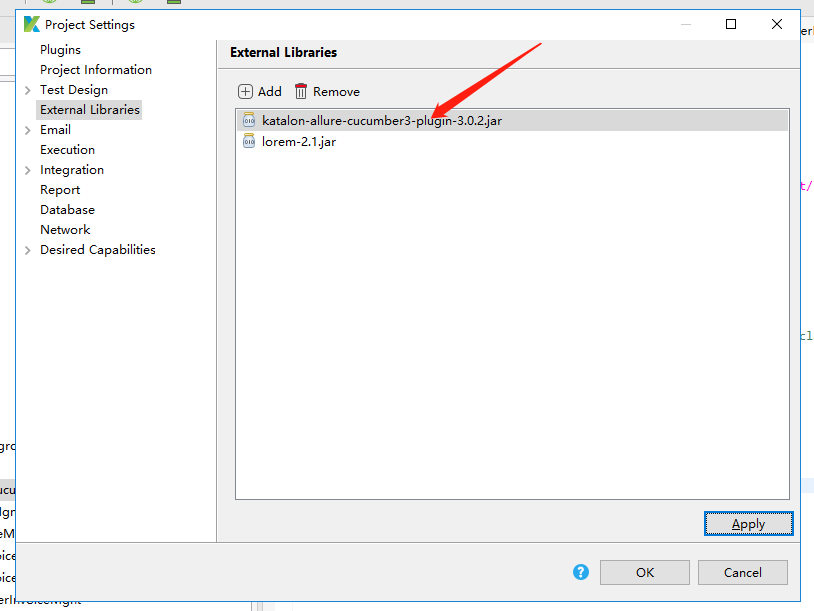

# [DEPRICATED]
## Please follow https://github.com/allure-framework/allure-java
Katalon Allure Cucumber3 Plugin
=====================

This plugin allows to generate allure xml reports after cucumber-jvm tests execution.

## Example project
Example projects is located at: https://docs.katalon.com/katalon-studio/docs/running-cucumber-features-file.html#from-a-feature-file
## Release
 [katalon-allure-cucumber3-plugin.jar](https://github.com/spt110/katalon-allure-cucumber3-plugin/wiki/Release)

## Configure katalon-allure-cucumber3-plugin plugin Go to Project > Setting > Externall Libraries


## Generate allure-results
Example: [Run all Feature files](https://docs.katalon.com/katalon-studio/docs/running-cucumber-features-file.html#from-a-feature-file) in a specified file/folder, generate multi Cucumber reports with XML, JSON, HTML pretty format,allure-results, and copy to a specified folder
```
package myCucumber

import org.junit.runner.RunWith;
import cucumber.api.CucumberOptions;
import cucumber.api.junit.Cucumber;
import cucumber.api.java.After;
import cucumber.api.java.Before;
import io.qameta.allure.cucumber3jvm.katalon.AllureCucumber3Jvm
@RunWith(Cucumber.class)
@CucumberOptions(features="Include/features/Web UI Tests/Tests/sellerMgmt/invoiceMgmt/billInvoice/Import Bill Tests.feature", glue="", plugin = ["pretty",
	"junit:report-cucumber/cucumber.xml",
	"html:report-cucumber/cucumber-html-report",
	"json:report-cucumber/cucumber.json",
	"io.qameta.allure.cucumber3jvm.katalon.AllureCucumber3Jvm"
])
public class MyCucumberRunner {

}
```